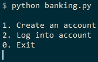

# Simple Banking System

Simulation of a Simple Banking System written in Python that uses sqlite3 to work with the SQL database.

This code was written for the [Simple Banking System assignment](https://hyperskill.org/projects/109) from the JetBrains Academy.

<br />
<p align="center">
  

## Table of Contents

* [Learning Outcomes](#learning-outcomes)
* [Additional Description](#additional-description)
  * [Luhn algorithm](#luhn-algorithm)
  * [sqlite3 database](#sqlite3-database)
* [Usage](#usage)
* [Workflow](#workflow)
  * [main menu actions](#main-menu-actions)
  * [account menu actions](#account-menu-actions)

## Learning Outcomes

I learned/practised:

* how the banking system works
* the purpose of the Luhn algorithm
* Python programming (classes, decorators, modular programming)
* design of a CLI menu application
* verifying and preventing errors from the user's input
* saving data in the SQLite database through a Python script.

## Additional Description

### Luhn algorithm

In our banking system, the Issuer Identification Number (IIN) is 400000, the customer account number can be any number, but it should be unique and have a length of 16 digits. The very last digit of a credit card is the check digit or checksum. It is used to validate the credit card number using the [Luhn algorithm](https://en.wikipedia.org/wiki/Luhn_algorithm).

Basically, the Luhn algorithm is used to create a checksum for a 15 digit random card number. This is then added to create a 16 digit card number.

### sqlite3 database

The application uses the **sqlite3** package to store all created cards in a database:

* database will automatically be created upon running
* db is called card.s3db
* database is reset upon each run for ease of use.

## Usage

Open your terminal inside the [banking](Simple%20Banking%20System/banking) folder and run:

```console
python banking.py
```

## Workflow

The symbol `>` represents the user input. Notice that it's not a part of the input.

### main menu actions

Once the program starts, it prints the main menu:

```console
1. Create an account
2. Log into account
0. Exit
```

**1. Create an account** – generate a new card number which satisfies all the conditions. Afterwards, generate a PIN code that belongs to the generated card number. A PIN code is a sequence of any 4 digits. PIN should be generated in a range from 0000 to 9999:

```console
> 1

Your card has been created
Your card number:
4000008334322372
Your card PIN:
5045
```

**2. Log into account** – ask the user to enter the card information. The program will store all generated data until it is terminated so that the user is able to log into any of the created accounts with the right card number and its pin. If the provided card number or PIN is incorrect, the user will be not able to log in:

```console
> 2

Enter your card number:
123
Enter your PIN:
123
Wrong card number or PIN!

1. Create an account
2. Log into account
3. Exit

> 2

Enter your card number:
4000008334322372
Enter your PIN:
5045
You have successfully logged in!
```

### account menu actions

After all login information is entered correctly, the program will allow the user to check the account balance; right after creating the account, the balance should be 0. It should also be possible to log out of the account and exit the program:

```console
1. Balance
2. Add income
3. Do transfer
4. Close account
5. Log out
0. Exit
```

**1. Balance** – read the balance of the account from the database and output it into the console:

```console
> 1

Balance: 0
```

**2. Add income** – deposit the requested amount on the account:

```console
> 2

Enter income:
> 423
Income was added!
```

Later, when checking the balance it will be 0 + 423 = 423:

```console
> 1

Balance: 423
```

**3. Do transfer** – transfer money to another account. This feature includes the following errors:

* if the user tries to transfer more money than he/she has, output: "_Not enough money!_"
* if the user tries to transfer money to the same account, output the following message: "_You can't transfer money to the same account!_"
* if the receiver's card number doesn’t pass the Luhn algorithm, you should output: "_Probably you made a mistake in the card number. Please try again!_"
* if the receiver's card number doesn’t exist, you should output: "_Such a card does not exist._"
* if there is no error, ask the user how much money they want to transfer and make the transaction.

```console
> 3

Enter card number:
> 4000003305160034
Enter how much money you want to transfer:
> 200
Success!
```

**4. Close account** – delete the logged in account from the database:

```console
> 4

The account has been closed!
```

**5. Log Out** – log out the user and come back to the main menu:

```console
> 5

You have successfully logged out!
```

**0. Exit** – terminate the simulation and say "Bye!" to the user:

```console
> 0

Bye!
```
